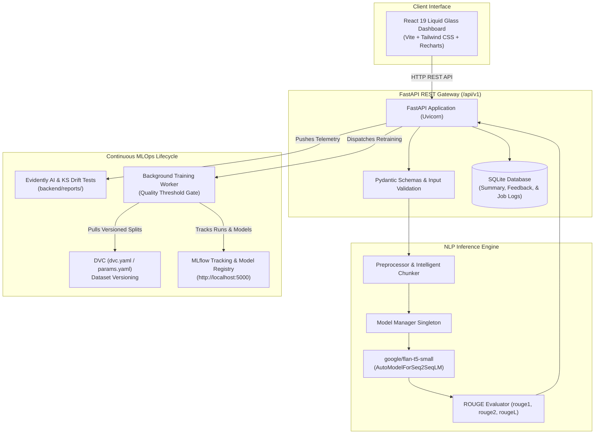

# Text Summarization Pipeline

> **Text Summarization Pipeline — Intelligent NLP & Continuous MLOps Platform**  
> *Production-grade NLP summarization powered by Google FLAN-T5, FastAPI, MLflow experiment tracking, DVC dataset versioning, Evidently AI drift monitoring, Docker Compose, and a Liquid Glass React dashboard.*

[](https://github.com/Ruthvik1207/text-summarization-pipeline/actions)
[](https://www.python.org/)
[](https://fastapi.tiangolo.com/)
[](https://react.dev/)
[](https://mlflow.org/)
[](https://dvc.org/)
[](https://opensource.org/licenses/MIT)

---

## 1. Project Overview

The **Text Summarization Pipeline** is an end-to-end, production-ready Natural Language Processing (NLP) and Machine Learning Operations (MLOps) platform. It accepts long articles, research papers, news reports, or technical documentation and automatically generates concise, factual, and abstractive summaries while preserving critical context and semantic nuance.

Beyond raw summarization, the platform embodies a continuous learning and MLOps lifecycle:
- **Data Versioning**: Reproducible raw and processed splits managed with **DVC**.
- **Model Training & Fine-Tuning**: Sequence-to-sequence fine-tuning of **FLAN-T5** using PyTorch and Hugging Face Transformers.
- **Experiment Tracking**: Automatic parameter, metric, and artifact logging with **MLflow**.
- **Automated Quality Gating**: Threshold-based evaluation (ROUGE-1, ROUGE-2, ROUGE-L) preventing regressions before promoting candidate checkpoints to the **MLflow Model Registry**.
- **Production Monitoring**: Real-time distribution shift and concept drift analysis powered by **Evidently AI**.
- **Containerized Deployment**: Orchestrated via **Docker Compose** with health checks and automated GitHub Actions CI/CD workflows.

---

## 2. Problem Statement & Proposed Solution

### The Problem
Organizations face information overload from voluminous unstructured textual content. Generic summarization tools frequently suffer from:
1. Context window overflows and crashes when processing long documents.
2. Silent performance degradation and data drift in production without observable telemetry.
3. Lack of model versioning, evaluation reproducibility, and experiment lineage.
4. Rigid monolithic setups that lack modern, responsive user interfaces.

### The Proposed Solution
**SummarAI** provides a decoupled, resilient architecture:
- **Intelligent Chunking Engine**: Recursively segments lengthy documents into contextual paragraph and sentence chunks, summarizing each section and synthesizing the results to avoid token limit errors.
- **Continuous MLOps Pipeline**: Integrates DVC, MLflow, and Evidently AI to track every dataset revision, training run, model checkpoint, and live inference metric.
- **Liquid Glass Control Center**: A dark futuristic web dashboard featuring frosted glass cards, real-time telemetry, Recharts analytics, and interactive REST documentation.

---

## 3. System Architecture



---

## 4. Technology Stack

| Layer | Technologies |
|---|---|
| **Frontend** | React 19, TypeScript, Vite, Tailwind CSS, Lucide React, Recharts, Framer Motion |
| **Backend API** | Python 3.11+, FastAPI, Uvicorn, Pydantic v2, Pydantic-Settings, SQLAlchemy, SQLite |
| **NLP & Deep Learning** | Hugging Face Transformers, Google FLAN-T5 (`google/flan-t5-small`), PyTorch, Tokenizers, Evaluate, ROUGE |
| **MLOps & Tracking** | MLflow 3.16+, DVC 3.67+, Evidently AI, Scikit-learn, Scipy, Pandas |
| **DevOps & CI/CD** | Docker, Docker Compose, Nginx, GitHub Actions |

---

## 5. Repository Structure

Per architectural requirements, all project logic is isolated strictly into two primary folders: `frontend/` and `backend/`:

```
text-summarization-pipeline/
├── frontend/                     # React + TypeScript Frontend
│   ├── src/
│   │   ├── components/           # GlassCard, Navbar, StatusBadge, MetricCard
│   │   ├── pages/                # Dashboard, Summarize, Analytics, MLOps, Monitoring, ApiDocs, Settings
│   │   ├── services/             # API client service
│   │   ├── types/                # TypeScript interface definitions
│   │   ├── App.tsx               # Root application component
│   │   ├── main.tsx              # React DOM mounting
│   │   └── index.css             # Liquid Glass design tokens and typography
│   ├── public/                   # Static assets
│   ├── nginx.conf                # Production reverse proxy configuration
│   ├── Dockerfile                # Multi-stage frontend Docker build
│   ├── package.json              # NPM dependencies and scripts
│   ├── tsconfig.json             # TypeScript configuration
│   └── vite.config.ts            # Vite bundler configuration
│
├── backend/                      # FastAPI, PyTorch, ML, MLOps, & Datasets
│   ├── app/
│   │   ├── api/                  # REST route definitions
│   │   ├── ml/                   # Model loader singleton, preprocessor, chunker, evaluation
│   │   ├── models/               # SQLAlchemy ORM models
│   │   ├── monitoring/           # Evidently AI & KS drift analyzer
│   │   ├── schemas/              # Pydantic request/response schemas
│   │   ├── services/             # Summarizer, MLflow, Dataset, Training, Analytics services
│   │   ├── training/             # PyTorch training pipeline & quality gating
│   │   ├── utils/                # Structured logger
│   │   ├── config.py             # BaseSettings configuration
│   │   ├── database.py           # Database connection & SessionLocal
│   │   └── main.py               # FastAPI entrypoint, CORS, lifespan
│   ├── data/
│   │   ├── raw/                  # Raw dataset (dataset.csv)
│   │   ├── processed/            # Train and validation partitions (train.csv, val.csv)
│   │   └── reference/            # Baseline distribution metrics (reference_baseline.csv)
│   ├── models/                   # Local model checkpoints & promoted candidate weights
│   ├── artifacts/                # Training run evaluation reports & artifacts
│   ├── reports/                  # Generated Evidently HTML drift reports
│   ├── scripts/                  # DVC pipeline stage scripts (prepare, train, monitor)
│   ├── tests/                    # Pytest test suite (health, summarize, validation, ml, monitoring)
│   ├── Dockerfile                # Backend container configuration
│   ├── dvc.yaml                  # DVC reproducible pipeline stages
│   ├── params.yaml               # Pipeline hyperparameters and data paths
│   └── requirements.txt          # Python dependencies
│
├── .github/
│   └── workflows/
│       └── ci.yml                # Automated GitHub Actions CI workflow
├── docker-compose.yml            # Multi-container orchestration (frontend, backend, mlflow)
├── .env.example                  # Environment configuration template
├── .gitignore                    # Git ignore rules for virtualenvs, artifacts, and weights
└── README.md                     # Comprehensive project documentation
```

---

## 6. Installation & Quick Start

### Option 1: Run with Docker Compose (Recommended)

Start all services (Frontend, Backend, and MLflow) with a single command:

```bash
docker compose up --build
```

**Services Available:**
- **Frontend Dashboard**: [http://localhost:5173](http://localhost:5173)
- **FastAPI Backend**: [http://localhost:8000](http://localhost:8000)
- **Interactive Swagger Docs**: [http://localhost:8000/docs](http://localhost:8000/docs)
- **MLflow Tracking UI**: [http://localhost:5000](http://localhost:5000)

---

### Option 2: Run Locally (Bare Metal)

#### Prerequisites
- Python 3.11+ (Python 3.11, 3.12, or 3.14)
- Node.js 20+ and npm 10+
- Git

#### 1. Backend Setup

```bash
cd backend

# Create and activate virtual environment
python -m venv .venv
# On Windows:
.venv\Scripts\activate
# On Linux/macOS:
source .venv/bin/activate

# Install dependencies
pip install --upgrade pip
pip install -r requirements.txt

# Run database setup and prepare dataset splits
python scripts/prepare_data.py

# Launch FastAPI development server
uvicorn app.main:app --host 127.0.0.1 --port 8000 --reload
```

Backend will be available at [http://127.0.0.1:8000](http://127.0.0.1:8000).

#### 2. Frontend Setup

In a new terminal:

```bash
cd frontend

# Install dependencies
npm install

# Start Vite development server
npm run dev
```

Frontend will open at [http://127.0.0.1:5173](http://127.0.0.1:5173).

---

## 7. Environment Variables

Copy `.env.example` to create your local `.env`:

```bash
cp .env.example .env
```

| Variable | Default Value | Description |
|---|---|---|
| `PROJECT_NAME` | `Text Summarization Pipeline` | Official title of the project |
| `MODEL_NAME` | `google/flan-t5-small` | Hugging Face model identifier |
| `MODEL_VERSION` | `1.0.0` | Active model version string |
| `DEVICE` | `cpu` | PyTorch compute device (`cpu` or `cuda`) |
| `MAX_INPUT_LENGTH` | `2048` | Maximum accepted document character length |
| `DATABASE_URL` | `sqlite:///./data/summarai.db` | SQLAlchemy database connection string |
| `MLFLOW_TRACKING_URI` | `http://localhost:5000` | MLflow tracking server address |
| `MLFLOW_EXPERIMENT_NAME` | `text-summarization` | Default experiment namespace |
| `MIN_ROUGE_L_THRESHOLD` | `0.35` | Minimum ROUGE-L score required for candidate promotion |
| `VITE_API_URL` | `http://localhost:8000/api/v1` | Backend API base URL for frontend |

---

## 8. MLOps Workflows

### DVC (Data Version Control)

All datasets are versioned inside `backend/data/`.

```bash
cd backend

# Initialize DVC
dvc init

# Reproduce the data pipeline stages (prepare -> train -> monitor)
dvc repro

# Inspect metrics across runs
dvc metrics show
```

#### Configuring Remote Storage (e.g., S3 or Google Cloud Storage)

```bash
# S3 example (credentials via standard AWS env variables)
dvc remote add -d myremote s3://my-mlops-bucket/summarization/
dvc push
```

---

### MLflow Experiment Tracking & Model Registry

When training is executed (either via the UI or `POST /api/v1/train`), MLflow records:
- **Parameters**: `model_name`, `learning_rate`, `epochs`, `batch_size`, `dataset_version`
- **Metrics**: `ROUGE-1`, `ROUGE-2`, `ROUGE-L`, `training_loss`, `validation_loss`
- **Artifacts**: Serialized model checkpoint, tokenizer configuration, evaluation JSON report
- **Model Registry**: If candidate validation ROUGE-L &ge; 0.35, the checkpoint is automatically registered as `text-summarization-model`.

Access the MLflow UI at [http://localhost:5000](http://localhost:5000).

---

### Evidently AI Drift Monitoring

The monitoring service checks inference distributions against reference baselines (`backend/data/reference/reference_baseline.csv`):
- Feature drift testing on input length, summary output length, compression ratio, and latency.
- HTML reports saved to `backend/reports/monitoring_report_<timestamp>.html`.
- Telemetry accessible through `GET /api/v1/monitoring`.

---

## 9. REST API Specification

Base URL: `/api/v1`

| Method | Endpoint | Description |
|---|---|---|
| `GET` | `/health` | API operational readiness, model cache status, and MLflow connection |
| `POST` | `/summarize` | Generate abstractive summary with length and temperature control |
| `GET` | `/model` | Retrieve active model architecture, parameters count, and device |
| `GET` | `/metrics` | Retrieve real historical summary analytics and distributions |
| `GET` | `/monitoring` | Retrieve Evidently AI data drift and telemetry metrics |
| `GET` | `/mlflow` | Retrieve MLflow experiment lineage and Model Registry state |
| `GET` | `/dataset` | Retrieve dataset version, record count, and partition splits |
| `POST` | `/feedback` | Submit user review and reference summary for continuous improvement |
| `POST` | `/train` | Dispatch background fine-tuning pipeline with quality gating |
| `GET` | `/training/status` | Poll active retraining progress (0-100%) and candidate ROUGE scores |

Interactive documentation is available at [http://localhost:8000/docs](http://localhost:8000/docs) (Swagger) and [http://localhost:8000/redoc](http://localhost:8000/redoc) (ReDoc).

---

## 10. Automated Testing

Run the full pytest backend test suite:

```bash
# Run from repository root or backend folder
pytest backend/tests/ -v --disable-warnings
```

Validate frontend production build:

```bash
cd frontend
npm run build
```

---

## 11. GitHub Actions CI/CD

The workflow in `.github/workflows/ci.yml` triggers on every push and pull request to `main`:
1. Checks out the repository.
2. Sets up Python 3.11, installs dependencies, and validates the FastAPI app.
3. Runs the Pytest test suite with code assertions.
4. Sets up Node.js 22, installs npm dependencies, and executes `npm run build`.
5. Builds Docker container images for both backend and frontend to verify deployability.

---

## 12. Pushing to GitHub

To push this repository to GitHub:

```bash
git init
git add .
git commit -m "Initial commit: Complete Text Summarization Pipeline with Liquid Glass UI"
git branch -M main
git remote add origin https://github.com/Ruthvik1207/text-summarization-pipeline.git
git push -u origin main
```

---

## 13. License

Distributed under the MIT License. See `LICENSE` for more information.
